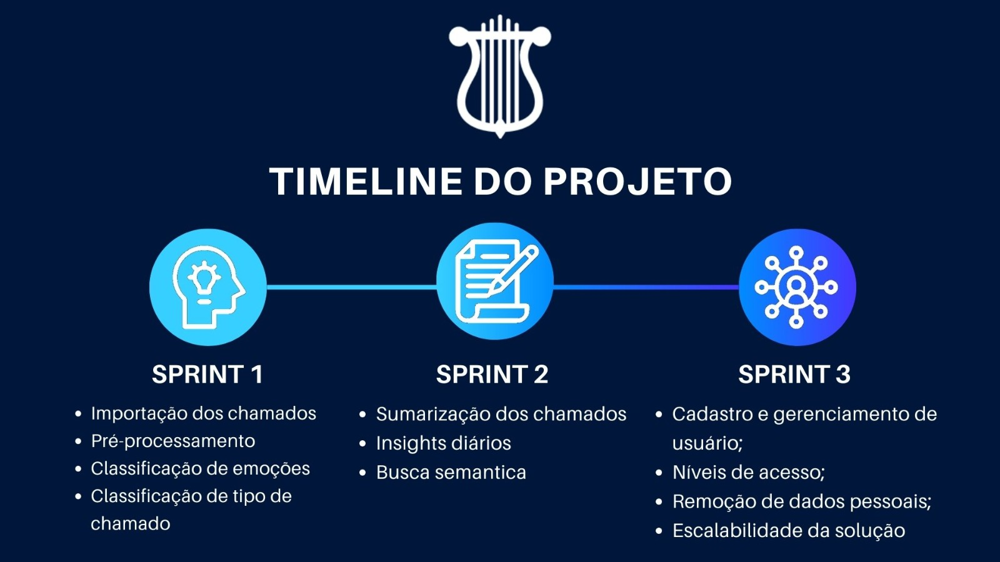

# apolo-documentation

<h1 id="topo" align="center">  Apolo  </h1>

 

 
  <a href="#sobre">Sobre</a>  |  
  <a href="#entregas">Entregas</a>  |
  <a href="#backlog">Backlog</a> |
  <a href="#timeline">Timeline Sprints</a> |
  <a href="#repositorios"> Repositórios</a> |
  <a href="#tecnologias">Tecnologias</a>  |
  <a href="#equipe">Equipe</a> |

---

## 🗺️  Sobre o Projeto

## Automação e Extração de Informações em Atendimento Inteligente

Em um cenário onde empresas lidam com grandes volumes de interações textuais (como chatbots, CRMs e assistentes virtuais), analisar esses dados manualmente se torna ineficiente e demorado. Este projeto tem como objetivo automatizar a extração e sumarização de informações a partir de conversas de atendimento, permitindo que organizações identifiquem rapidamente os principais pontos, classifiquem interações e gerem insights acionáveis para melhorar a experiência do cliente.

Desenvolvido como parte do Projeto Integrador do 6º semestre de DSM (Desenvolvimento de Software Multiplataforma) da FATEC, em parceria com a IT-01, a solução aplica técnicas de Processamento de Linguagem Natural (PLN) para:

🔍 Extrair informações relevantes de textos não estruturados.

📂 Classificar automaticamente interações (ex: reclamações, dúvidas, solicitações).

✂️ Gerar sumários concisos das conversas, destacando os tópicos mais importantes.

📊 Fornecer dashboards interativos com métricas como tempo médio de atendimento e tendências de interação.

Além disso, o sistema foi projetado para ser escalável, seguro e em conformidade com a LGPD, garantindo que dados sensíveis sejam protegidos. Com essa solução, empresas podem reduzir a carga de análise manual, acelerar a tomada de decisão e melhorar a eficiência do atendimento.

→ [Voltar ao topo](#topo)

---

## 🔨 Entregas

**Separamos o projeto em SPRINTS e para uma análise mais detalhada, sobre o que fizemos em cada uma, você consegue acessando o link abaixo**

**Por enquanto estamos com a 1 sprint finalizada, lá descrevemos o que fizemos, têm nosso burndown, vídeo de funcionamento, entre outros.**

*Clique em relatório e veja nossa evolução!*

| Sprint | Previsão | Status | Relatório da Sprint |
|:--:|:----------:|:------------:|:-------------:|
| 01 | 30/03/2025 | ✔️ Concluída | [Relatório](https://github.com/Apolo-API-6-DSM/apolo-documentation/blob/main/sprints/sprint1.md) |
| 02 | 27/04/2025 | ✔️ Concluída | [Relatório](https://github.com/Apolo-API-6-DSM/apolo-documentation/blob/main/sprints/sprint2.md) |
| 03 | 25/05/2025 | 🔒 Pendente |  |

→ [Voltar ao topo](#topo)

---

## 📝 Backlog do Produto

| Sprint | Requisito | Status |
|:------:|:----------|:------:|
| 1 | Importação e pré-processamento dos dados das interações atendente-cliente | ✔️ |  |
| 1 | Classificação de cada uma das chamados (Reclamação, Dúvida, Solicitação de suporte, Reincidência) | ✔️ |  |
| 1 | Análise de sentimento de cada um dos chamados (Satisfeito, Insatisfeito, Neutro) | ✔️ |  |
| 1 | Remoção de dados pessoais das interações (LGPD) | ✔️ |
| 2 | Sumarização de cada uma das chamadas (Destacar principais pontos da conversa) | ✔️ |
| 2 | Insights diários (estatísticas gerais sobre atendimentos) | ✔️ |
| 3 | Busca semântica (pesquisar interações com palavras naturais) |  |
| 3 | Cadastro e gerenciamento de usuários (com LGPD) |  |
| 3 | Níveis de acesso (Viwer e Admin) |  |
| 3 | Solução escalável (uso de serviços de nuvem) |  |

## 📝 Timeline das Sprints

  

 

---

### Para visualização das user stories do projeto:
→ [Ver Epics e UserStories](https://github.com/Apolo-API-6-DSM/apolo-documentation/blob/main/docs/backlog.md)

→ [Voltar ao topo](#topo)

---

## 📡 Repositórios

- → [Serviço Backend](https://github.com/Apolo-API-6-DSM/apolo-backen)
- → [Serviço Frontend](https://github.com/Apolo-API-6-DSM/apolo-frontend)
- → [Serviço de IA](https://github.com/Apolo-API-6-DSM/apolo-IA)
- → [Microsserviço de tratamento dos datasets](https://github.com/Apolo-API-6-DSM/apolo-pre_processamento)

→ [Voltar ao topo](#topo)

---

## 🛠️ Tecnologias utilizadas

| Ferramenta      | Tipo de Tecnologia       |
|:---------------:|:-----------------------:|
| **TypeScript**  | 🔨 Desenvolvimento      |
| **Next.js**     | 🔨 Desenvolvimento      |
| **Nest.js**     | 🔨 Desenvolvimento      |
| **Python**      | 🔨 Desenvolvimento      |
| **Colab**       | 🔨 Desenvolvimento      |
| **React**       | 🔨 Desenvolvimento      |
| **Docker**      | 🔧 Desenvolvimento      |
| **Git & GitHub**| 🔧 Controle de Versão   |
| **Prisma**      | 🔧 Banco de Dados       |
| **PostgreSQL**  | 🔧 Banco de Dados       |
| **MongoDB**     | 🔧 Banco de Dados       |
| **Slack**       | 👥 Comunicação          |
| **Jira**        | 👥 Gestão de Projetos   |
| **Figma**       | 📝 Prototipação         |

<!-- | **AWS**         | ☁️ Infraestrutura na Nuvem | -->

→ [Voltar ao topo](#topo)

---

## 🧑‍💻 Colaboradores

|    Função     | Nome                                  |                                                                                                                                                      LinkedIn & GitHub                                                                                                                                                      |
| :-----------: | :------------------------------------ | :-------------------------------------------------------------------------------------------------------------------------------------------------------------------------------------------------------------------------------------------------------------------------------------------------------------------------: |
| Product Owner | Bruno Denardo |                |
| Scrum Master  | Igor Da Silva Pereira |               |
|   Dev Team    | Gabriela da Silva Barbosa |   |
|   Dev Team    | José Victor Henninger Lopes De Souza |   |
|   Dev Team    | Vitor Garcez de Oliveira |   |

→ [Voltar ao topo](#topo)
