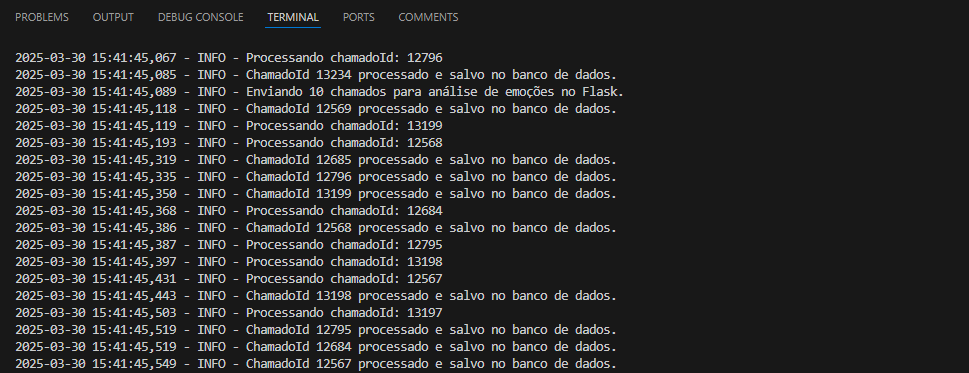
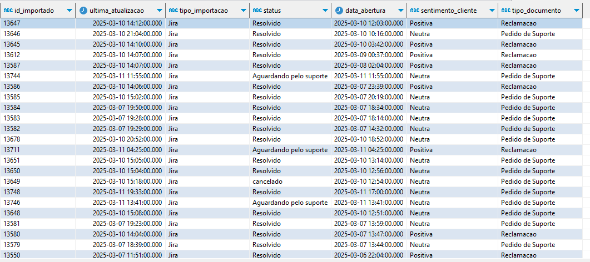
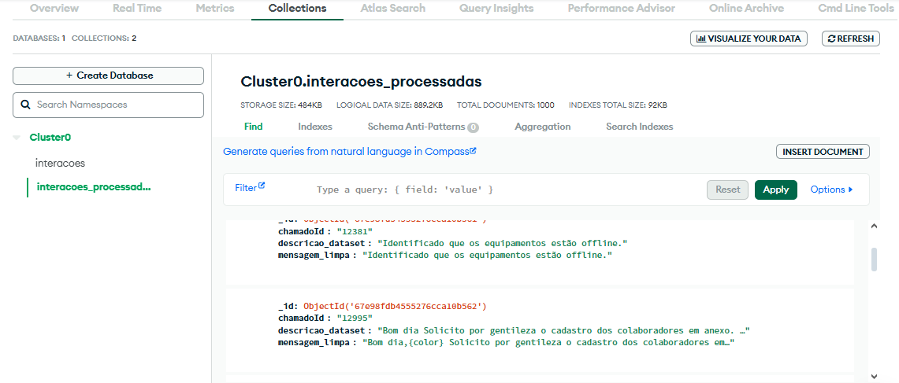
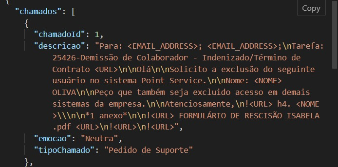
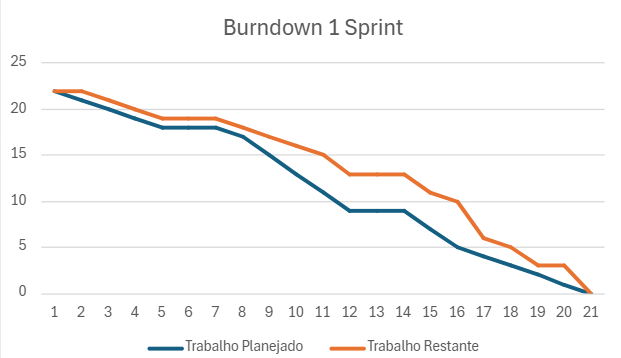

<h1 align="center"> Equipe Apolo - Sprint 1: 10/03/2025 à 30/03/2025 </h1>

 

    <a href="#objetivo">Objetivo da Sprint</a>  |  
    <a href="#entrega">Entregas</a>
    <a href="#backlog">📝 Backlog da Sprint</a>  |  
    <a href="#burndown">📉 Burndown</a>

---

<h2 id="objetivo">🎯 Objetivos da Sprint</h2>

O foco principal desta primeira sprint foi a realização de um MVP, onde o cliente já conseguisse importar os dados, gerando para ele uma listagem dos dados importados e já devolvendo a análise feita pela IA, sobre a emoção/sentimento e o tipo de chamado que o usuário abriu, ex: Suporte.

## 📊 Pipeline de Processamento de Dados

### 1. Importação do Dataset
- **Formato de entrada**: Arquivo Excel/CSV fornecido pelo parceiro
- **Processo**:
  - Upload via interface web
  - Validação automática de estrutura e formato
  - Conversão para JSON estruturado

### 2. Pré-processamento de Dados
- **Etapas de limpeza**:
  - Remoção de registros incompletos
  - Normalização de texto (minúsculas, acentos, caracteres especiais)
  - Tokenização de conteúdo

### 3. Anonimização de Dados
- **Proteção de PII**:
  - Substituição de nomes → `<NOME>`
  - Ocultação de e-mails → `<EMAIL>`
  - Mascaramento de telefones → `<TELEFONE>`
  - Substituição de CPFs → `<CPF>`
- **Técnicas**:
  - Expressões regulares (Regex)
  - Modelos de reconhecimento de entidades

### 4. Modelagem de IA
- **Classificação automática**:
  - Tipos de chamados (reclamação, dúvida, solicitação)
  - Modelo: Regressão Linear do Sklearn

- **Análise de sentimentos**:
  - Polaridade (positivo, neutro, negativo)
  - Modelo: Regressão Linear do Sklearn

### 5. Visualização de Dados
#### Telas Implementadas:
| Funcionalidade          | Descrição                                                                 |
|-------------------------|---------------------------------------------------------------------------|
| **Listagem**            | Filtros por tipo, data e status com paginação                             |
| **Importação**          | Interface drag-and-drop com feedback de progresso                         |
| **Detalhes**            | Visualização completa com sumarização automática e tags de classificação |

→ [Voltar ao topo](#topo)

<h2 id="entregas">📦 Entregas</h2>

### 🎥 Vídeo de Funcionamento do Projeto (Sprint 1)

Atualmente, o projeto está assim:

  

    
    

### 📸 Base de dados do dataset

    
    

### 📸 Teste no postman, devolvendo emoção e tipo de chamado

  

---

<h2 id="backlog">📝 Backlog da Sprint</h2>

**Alterar**

  
| Sprint | Requisito | Status |
|:------:|:----------:|:------:|
| 1      | Importação e pré-processamento dos dados das interações atendente-cliente | ✔️ |
| 1      | Classificação de tipo de chamado | ✔️ |
| 1      | Análise de sentimento de cada um dos chamados | ✔️ |

---

<h2 id="burndown">📉 Burndown</h2>

    Este é o burndown da equipe atualizado, na primeira sprint:

  

→ [Voltar ao topo](#topo)
