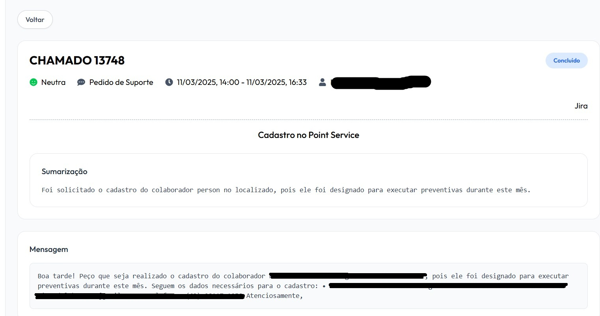
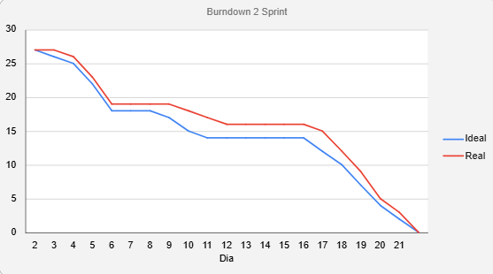

<h1 align="center"> Equipe Apolo - Sprint 2: 07/04/2025 à 27/04/2025 </h1>

 

    <a href="#objetivo">Objetivo da Sprint</a>  |  
    <a href="#entrega">Entregas</a>
    <a href="#backlog">📝 Backlog da Sprint</a>  |  
    <a href="#burndown">📉 Burndown</a>

---

<h2 id="objetivo">🎯 Objetivos da Sprint</h2>

O time optou por concentrar seus esforços no front-end, entregando uma interface totalmente configurada e funcional, com busca semântica pronta para uso. Embora inicialmente fôssemos fornecer dados mockados, avançamos a ponto de integrar e exibir dados reais, permitindo ao cliente importar informações, visualizar a listagem completa e receber imediatamente a análise de IA sobre sentimento e classificação do chamado (por exemplo: Suporte).

<h2 id="entregas">📦 Entregas</h2>

### 🎥 Vídeo de Funcionamento do Projeto (Sprint 2)

Como nossa entrega, nessa sprint foi mais focada no frontend, por preferência do cliente, aqui está o funcionamento atualmente dos dados, todos já integrados com o backend, ou seja, são todos valores reais!

<h3>Tela Home</h3>
  

<h3>Tela Dos Dashboards</h3>
  

<h3>Tela Para Realizar As Importações</h3>
  

<h3>Tela Das Importações Realizadas</h3>
  

<h3>Tela Da Listagem De Chamados</h3>
  

<h3>Tela Do Usuário Logado</h3>
  

<h3>Dark Mode E SideBar</h3>
  

### 📸 Print da tela com a sumarização

    

---

<h2 id="backlog">📝 Backlog da Sprint</h2>

**Alterar**

  
| Sprint | Requisito | Status |
|:------:|:----------:|:------:|
| 2 | Sumarização de cada uma das chamadas (Destacar principais pontos da conversa) | ✔️ |
| 2 | Insights diários (estatísticas gerais sobre atendimentos) | ✔️ |
| 2 | Telas finalizadas | ✔️ |

---

<h2 id="burndown">📉 Burndown</h2>

    Tivemos alguns realocamentos na equipe, para que conseguissemos priorizar o frontend, mas mesmo assim, conseguimos manter uma sequência excelente para o burndown

  

→ [Voltar ao topo](#topo)
