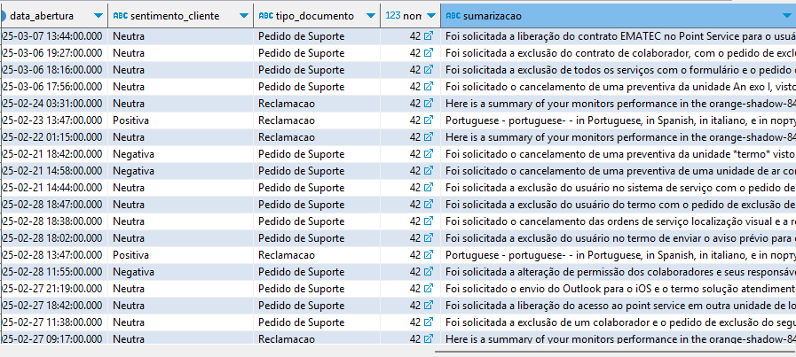
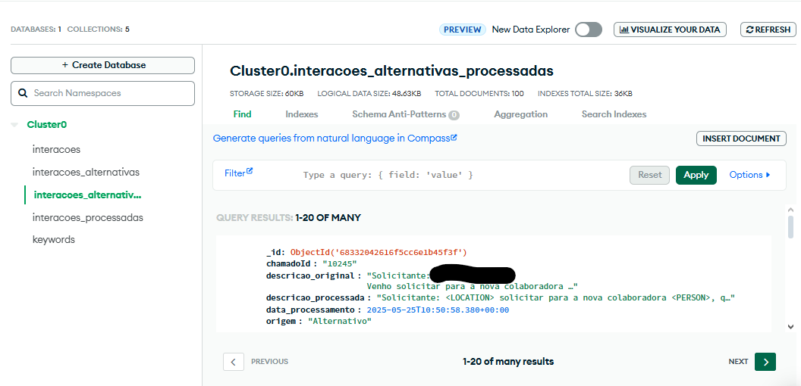
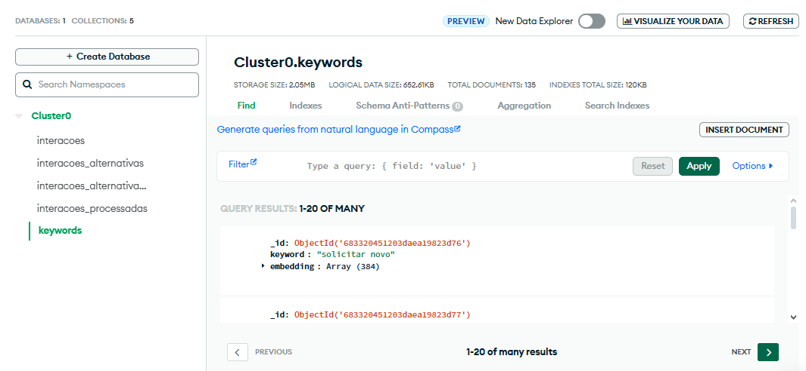
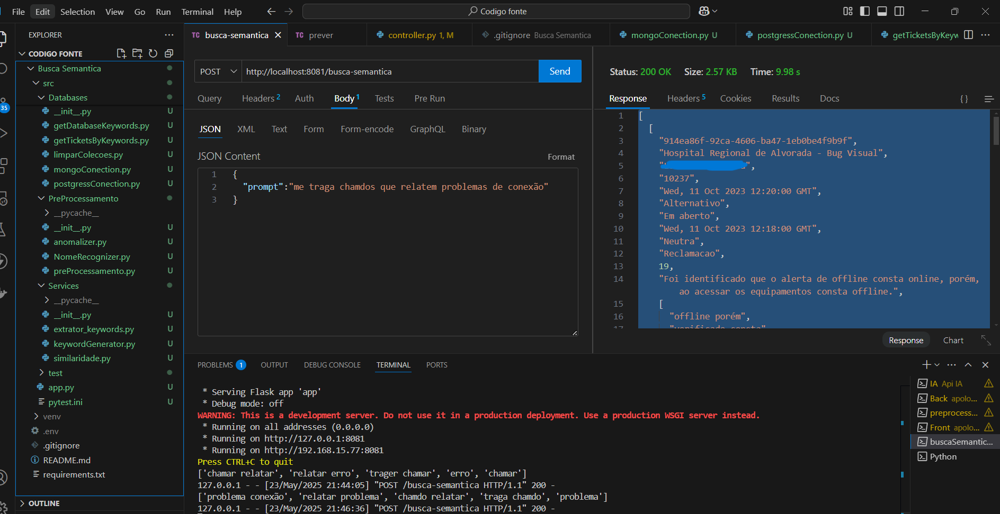
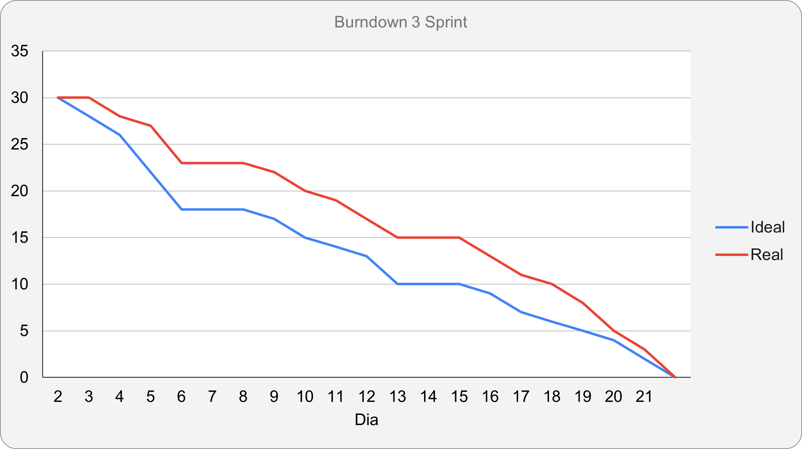

<h1 align="center"> Equipe Apolo - Sprint 3: 05/05/2025 à 25/05/2025 </h1>

 

    <a href="#objetivo">Objetivo da Sprint</a>  |  
    <a href="#entrega">Entregas</a>
    <a href="#backlog">📝 Backlog da Sprint</a>  |  
    <a href="#burndown">📉 Burndown</a>

---

<h2 id="objetivo">🎯 Objetivos da Sprint</h2>

Sprint passada, o time conseguiu avançar muito no frontend, praticamente finalizando-o, deixando apenas alguns detalhes para serem feitos, o que resultou no esforço do pré processamento e IA, fazendo com que o time estivesse dando maior prioridade para essas funcionalidades, algo que deu certo! Além do time conseguir o resultado esperado, conseguiu entregar além. Temos tratamento de qualidade nas informações, incluindo anonymazer, busca semântica funcional e análise de sentimento, sumarização e muitos outros recursos ativos e prontos! Inclusive a separação, autorização, identificação e regras de usuários!

OBS: Para essa sprint, foi necessário criar um novo repositório, para busca semântica.

<h2 id="entregas">📦 Entregas</h2>

### 🎥 Vídeo de Funcionamento do Projeto (Sprint 3)

<h3>Aqui estão gifs e imagens das nossas alterações nessa terceira sprint, mas em cada documento, há prints e gifs do funcionamento do sistema, não se limitando nas imagens e gifs a seguir.</h3>

<h4>Alterando o frontend (com a sugestão do cliente) e adicionando as técnicas e funcionalidades implementadas pelo time (algo decidido em nossas reuniões em grupo), o projeto ficou assim:</h4>

<h3>Busca Semântica</h3>
  

<h3>Login Funcional</h3>
  

<h3>Tela de entrada do viewer</h3>

O admin têm mais autorizações do que o viewer, como por exemplo cadastrar novos viewers, importar projeto e ver os projetos importados, por isso as telas são diferentes. Tudo isso funciona com token jwt.

  

<h3>Tela listagem e cadastro do viewers</h3>
  

<h3>Tela de detalhes dos viewers</h3>
  

<h3>Perfil do próprio usuário</h3>
  

<h3>Nova Dashboard</h3>

Agora é possível, em um único filtro, filtrar quase todos os dashboards da tela, mas também pode procura-los individualmente.

  

<h3>Tela de detalhes do chamado</h3>

Agora os chamados estão trazendo os comentários e a a nova implementação é que o viewer vê com anonymazer, enquanto o admin vê com os dados reais, apenas tratados.

  

<h3>Banco de dados relacional (sumarização, sentimento)</h3>
  

<h3>Anonymazer aplicado no banco de dados não relacional</h3>
  

<h3>Keyword para busca semântica</h3>
  

### 📸 Print da tela com busca semântica

    

---

<h2 id="backlog">📝 Backlog da Sprint</h2>

**Alterar**

  
| Sprint | Requisito | Status |
|:------:|:----------:|:------:|
| 3 | Busca semântica (pesquisar interações com palavras naturais) |  |
| 3 | Cadastro e gerenciamento de usuários (com LGPD) |  |
| 3 | Níveis de acesso (Viwer e Admin) |  |
| 3 | Solução escalável (uso de serviços de nuvem) |  |

---

<h2 id="burndown">📉 Burndown</h2>

    Com o frontend avançado, conseguimos focar na IA e no pré processamento.

  

→ [Voltar ao topo](#topo)
